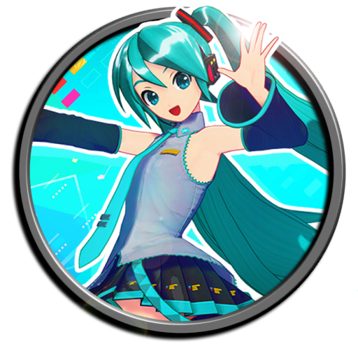

<div align="center">
  
  <h1>✨ Interactive Hatsune Miku ✨</h1>
  <p><b>A futuristic Sci-Fi HUD web application featuring a fully interactive Live2D Hatsune Miku powered by AI.</b></p>
  
  [](https://opensource.org/licenses/MIT)
  [](https://vitejs.dev/)
  [](https://reactjs.org/)
  [](https://fastapi.tiangolo.com/)
  [](https://openai.com/)
  [](https://elevenlabs.io/)
  [](https://spotify.com/)
</div>

<br />

## 🌟 Overview
**Interactive Miku** is a robust full-stack project that brings the world's most famous virtual idol to life. It combines a **React/Vite** frontend utilizing **PixiJS** for Live2D rendering, with a **FastAPI** backend driven by **LangChain** and **OpenAI's GPT-4o-mini** to grant Miku autonomous personality, emotion-based physical reactions, and TTS via ElevenLabs API.

> **Disclaimer**: This is a personal, non-profit passion project created strictly for educational purposes and skill application. I do not own the character Hatsune Miku. "Hatsune Miku" and its character design are copyrighted properties of Crypton Future Media, INC. used here under non-commercial fan-creation principles.

## 🚀 Key Features
* **Sci-Fi HUD UI**: A completely custom, responsive, and glassmorphic user interface with typing indicators, laser trails, and toast popups.
* **Live2D Integration**: Smooth, hardware-accelerated rendering of Miku with dynamic mouth-syncing (LipSync) tied directly to generated audio.
* **AI Personality Engine**: LangGraph and GPT-4 model simulating a warm, sweet-kawaii idol persona that reacts to messages with corresponding Live2D animations (shy, mad, surprised).
* **Multilingual Voices**: Powered by ElevenLabs TTS, generating instantaneous, natural-sounding voice responses.
* **Spotify Integration**: Miku can dynamically search for her own tracks, fetch follower counts, and retrieve album metadata directly using Spotify's API.

## 🛠️ Tech Stack
### **Frontend**
- **React 18** + **Vite** + **TypeScript**
- **Vanilla CSS** (Custom Sci-Fi Geometry & Glassmorphism)
- **PixiJS** & **pixi-live2d-display**

### **Backend**
- **Python 3.11** + **FastAPI**
- **LangChain** + **LangGraph**
- **OpenAI API** + **ElevenLabs API** + **Spotify API**

## 🌐 Deployments
* **Frontend**: Hosted on [GitHub Pages](https://haxellg.github.io/interactive-miku/)
* **Backend**: Hosted on [Render](https://render.com)

> **⏳ Note on backend performance:** The backend is deployed on Render's free tier. Render spins down free web services after a period of inactivity. This means that if the backend hasn't been used in a while, your first message to Miku might take around 40-50 seconds to process while the server wakes up. Afterwards, responses are completely instant!

## 💻 Running Locally

### Prerequisites
- Node.js 18+
- Python 3.11+
- API Keys for OpenAI, Spotify, and Tavily.
- **ElevenLabs Account**: You must have a **paid subscription tier** in ElevenLabs. Recent API policy updates require a paid tier to access community-created voice models via API (like the one used for Miku).

### Setup Steps
1. **Clone the repo**
   ```bash
   git clone https://github.com/HaxellG/interactive-miku.git
   cd interactive-miku
   ```
2. **Setup the Backend**
   ```bash
   cd backend
   python -m venv venv
   source venv/bin/activate  # On Windows: venv\Scripts\activate
   pip install -r requirements.txt
   ```
   Create a `.env` file in the `backend/` directory with your API keys. Use the `.env.example` file as a reference.
   
3. **Setup the Frontend**
   ```bash
   cd ../frontend
   npm install
   ```
4. **Run the Application**
   There is a custom `run.sh` script provided in the root directory to boot both servers simultaneously:
   ```bash
   cd ..
   ./run.sh
   ```
   The application foreground will be available at `http://localhost:5173`.

## 📜 License
This project is licensed under the **MIT License**. See the [LICENSE](LICENSE) file for more details. 
*Note that the MIT license only covers the code architecture; 3D assets, images, and character designs belong to their respective creators.*

<div align="center">
  <sub><i>Made with ❤️ by <b>HaxellG</b></i></sub>
</div>
